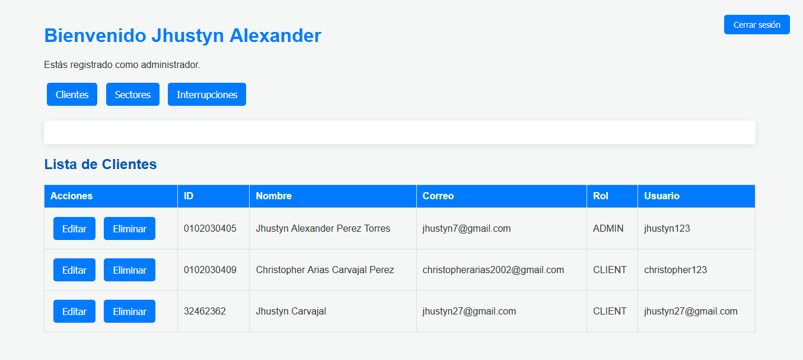
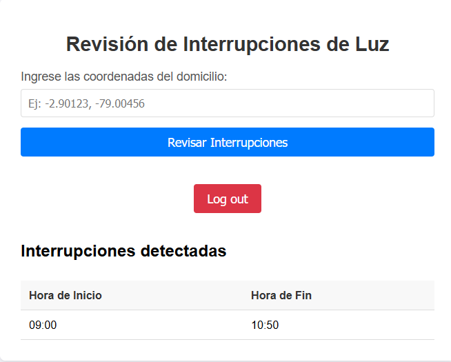
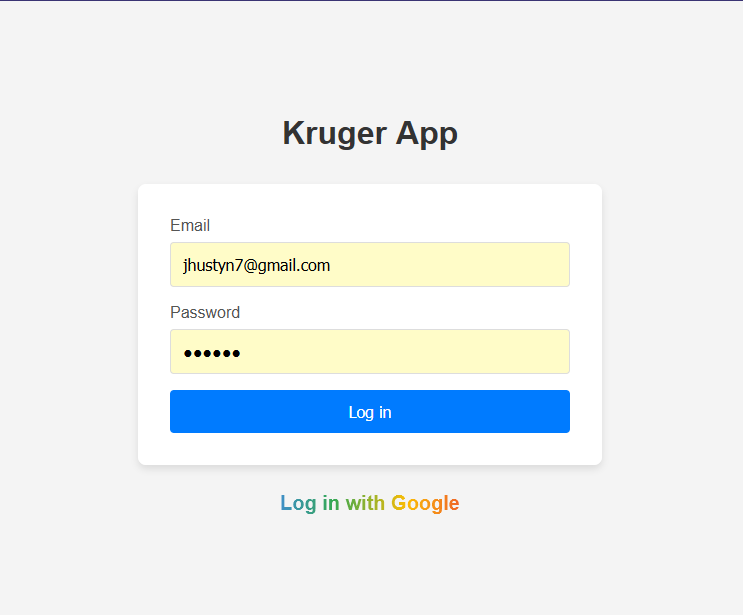

# Proyecto Kruger

**Autor:** Jhustyn Carvajal  
**Fecha:** 11/12/2024

Aplicación para llevar un registro de los horarios de interrupción del servicio de energía eléctrica.

## Los requisitos para levantar el proyecto se encuentran depues del Proceso de Desarrollo.

## Proceso de Desarrollo

La aplicación está desarrollada en **Node.js** enfocada principalmente en el Backend (utilizando Express) siguiendo los principios de **Clean Architecture**, con una estructura dividida en tres capas principales: **Presentation**, **Domain** e **Infrastructure**. Además, se aplica el patrón **MVC** para la implementación de los endpoints y las vistas (REST API).

La aplicación está diseñada para que el administrador pueda gestionar tres elementos principales:

1. **Usuarios**
2. **Sectores**
3. **Interrupciones**

Cada área cuenta con un CRUD completo. Por parte del cliente, solo tendrá acceso a la información de las interrupciones correspondientes a sus coordenadas.

las credenciales del dministrador son:

- admin@example.com
- 123456



Para determinar el horario de interrupciones según las coordenadas de un cliente, se considera el sector al que pertenece. Los sectores están definidos mediante polígonos. Para identificar si las coordenadas de un cliente se encuentran dentro de un polígono, se implementó el algoritmo **Ray Casting**, que permite verificar si un punto pertenece a un cuadrante formado por vértices.

Solo los usuarios registrados previamente por el administrador son los que tiene acceso al sistema

Las credenciales de un cliente son:

- client@example.com
- 123456

## 

### **1. Capa de Presentation**

En esta capa se encuentra:

- **Configuración del servidor:** Implementada con **Express**.
- **Rutas y controladores:** Los controladores consumen los casos de uso definidos en la capa de **Domain**.

---

### **2. Capa de Domain**

En esta capa se modela el dominio, incluyendo:

- **Entidades:** Representan los objetos principales del sistema.
- **DTOs:** Gestionan la transferencia de datos.
- **Casos de uso:** Implementan la lógica de negocio.
- **Abstracciones:** Definiciones de los **datasources** y **repositories** (usando el patrón Repository para mayor flexibilidad).

---

### **3. Capa de Infrastructure**

Aquí se gestiona la persistencia y manipulación de datos, utilizando:

- **Prisma ORM:** Simplifica la interacción con la base de datos y facilita la persistencia.
- **Manejo de datos:** Creación, modificación, obtención y eliminación de información.

---

### **Vistas**

El motor de plantillas **EJS** permite renderizar vistas dinámicas, ofreciendo una experiencia fluida al desarrollar y ejecutar el proyecto.

---

### **Auditoría**

El sistema incluye un módulo de auditoría para áreas como usuarios, sectores y login:

- Los registros se almacenan en el **file system**.
- La arquitectura permite cambiar fácilmente el sistema de almacenamiento según los requerimientos.

---

### **Autenticación y Autorización**

El sistema utiliza **OAuth 2.0 (Google)** para gestionar la autenticación, permitiendo a los usuarios acceder mediante sus cuentas de Google. Además, se ofrece la opción de inicio de sesión mediante correo, contraseña y rol, los cuales serán asignados por el o los administradores del sistema.



**Recomendación:**  
Utiliza un correo vinculado a una cuenta de Google. Esto te permitirá acceder al sistema tanto con OAuth como con credenciales tradicionales usando el mismo correo, garantizando una experiencia de usuario fluida.

---

### **Documentación Swagger**

La documentación inicial está implementada pero no completamente detallada. Puedes acceder a ella en:  
`http://localhost:3000/api-docs/`

---

### **Testing**

El proyecto no incluye pruebas debido a limitaciones de tiempo. Sin embargo, las pruebas se implementarían utilizando **Jest** y **Supertest**.

---

## Requisitos

- **Versión de Node.js:** 18.20.4

---

## Configuración del Proyecto

Para poder levantar el proyecto primero se instalan las depencias en la ruta raiz del proyecto
mediante el comando:
npm i

### 1. Configurar las variables de entorno

Crear el archivo `.env`, agrega las variables según el entorno que utilices:
Se tiene la extructura en el .env.template

#### Configuración para una base de datos en la nube (RECOMENDADO):

Proporciona el enlace de conexión completo para la base de datos (DATABASE_URL) colocalo en el .env

Se recomienda utilizar las credenciales adjuntas en el crdentials.txt para levantar el proyecto

#### Configuración para Docker (PostgreSQL):

En caso de querer usar docker configura las varibles de entorno

```env
POSTGRES_USER=mi_usuario
POSTGRES_DB=mi_base_de_datos
POSTGRES_PASSWORD=mi_contraseña
POSTGRES_PORT=5432
```

### 2. Levantar el entorno con Docker

Si deseas utilizar Docker para la base de datos:
Se proporciona un archivo docker compose que se puede personalizar

```bash
docker-compose up -d
```

### 3. Iniciar Prisma (Importante)

En caso de no usar la base de datos en la nube que ya se proporciono y es recomendado
puedes migrar la configuracion a otra base mediante prisma
Inicializa Prisma para que utilice PostgreSQL como proveedor de datos:

```bash
npx prisma init --datasource-provider postgres
```

### 4. Realizar migraciones en Prisma

Por cada cambio en el esquema de Prisma, ejecuta:

```bash
npx prisma migrate dev --name <descripcion_de_la_migracion>
```

Esto aplicará los cambios a la base de datos y generará un nuevo cliente Prisma.

---

### 4. Levantar Aplicación

Una vez realizados todas las configuraciones
Ejcutar el comando:

`npm run dev`

---

## Ejemplo de Petición POST para Crear Usuarios

### Endpoint: `/usuarios`

#### Body:

```json
{
  "idCard": "0102030405",
  "coordinates": [-2.8974, -79.0045],
  "names": "Jhustyn Alexander",
  "surnames": "Perez Torres",
  "mail": "jhustyn@example.com",
  "role": "ADMIN",
  "username": "jhustyn123",
  "password": "securePassword123"
}
```

---

## Probar Rutas Privadas (Endpoints)

Para acceder a rutas privadas, incluye la siguiente cookie en el header de las peticiones:

**Header:**

```
Cookie: connect.sid=s%3AN2ZWlZKQrDyExMHauR_lnE9OcIg4Qfyr.EsGDJCn9x2F6bxRSmog4KVsS2blIvVEvWUBagBH3ZjU
```

### Nota:

Este valor de la cookie se obtiene tras autenticarse en la aplicación.

---

## Notas Adicionales

- Asegúrate de tener configurado correctamente el archivo `.env` antes de iniciar el proyecto.
- Utiliza `docker-compose` únicamente si decides correr la base de datos en un contenedor Docker.
- Prisma debe estar correctamente configurado para reflejar los cambios en el esquema de base de datos.
